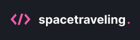

<section align="center">
    
</section>

---

<h2 align="center">Summary</h2>

    <a href="#description">📙 Description</a>
    <a href="#preview">🖼️ Preview</a>
    <a href="#technologies">💻 Technologies</a>

<H2 id="about">📙 Description</H2>

A very challenging task brought by Ignite Rockeseat that consisted in building almost the whole application aiming on the result available on the description of the project. It was required to use all the knowledge acquired on the previous chapters and apply'em to build this application from zero.

It used a NextJS based structure and styling tools like CSS modules and SASS.

Originally created on Ignite from <a href="https://www.rocketseat.com.br/">Rocketseat</a> and made by <a href="https://www.linkedin.com/in/kleverson-kenji-iwatani/">Kenji Iwatani</a>

    <h3><a href="https://www.notion.so/Desafio-01-Criando-um-projeto-do-zero-b1a3645d286b4eec93f5f1f5476d0ff7">Challenge description &rarr;</a></h3>

---

<H2 id="preview">🖼️ Preview</H2>

<section align="center">
    
</section>

---

<H2 id="technologies">💻 Technologies</H2>

- [x] <a href="https://nextjs.org/">NextJS</a>
- [x] <a href="https://reactjs.org/">React</a>
- [x] <a href="https://www.typescriptlang.org/">Typescript</a>
- [x] <a href="https://github.com/css-modules/css-modules">CSS Modules</a>
- [x] <a href="https://sass-lang.com/">SASS</a>
- [x] <a href="https://prismic.io/">Prismic</a>
- [x] <a href="https://react-icons.github.io/react-icons/">React Icons</a>
